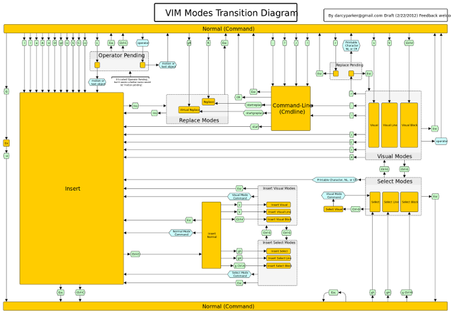

# Ejercicios de Vim del taller de editores

### Intro Vim
* Historia
* Modos
* Movimientos
* Órdenes

### Historia
* 1976 Bill Joy desarrolla Vi como mejora a ex
* 1991 Bram Moolenaar desarrolla Vim ("Vi iMitated"/"Vi iMproved")
* 1998 Versión 5.0 (syntax highlighting, basic scripting)
* 2006 Versión 7.0 (spell check, tabs, *autocompletion*)
* 2013 Versión 7.4 (nuevo motor regex)
* [Why vim uses hjkl as arrow keys](http://www.catonmat.net/blog/why-vim-uses-hjkl-as-arrow-keys/)

### Modos
* Normal: tecla ESC para volver al modo normal.
* Insert: i,a,I,A,o,O
* Visual: v,V,CTRL-v

[](https://rawgit.com/darcyparker/1886716/raw/eab57dfe784f016085251771d65a75a471ca22d4/vimModeStateDiagram.svg)

### Movimientos
```
h # izquierda
j # abajo
k # arriba
l # derecha
^,0 # principio de línea
$ # fin de línea
gg # Arriba del todo
G # abajo del todo
w,W # siguiente palabra, Palabra
b,B # anterior palabra, Palabra
e,E # siguiente fin de palabra, Palabra
ge,gE # anterior fin de palabra, Palabra
f{char} # siguiente carácter {char} en la línea
F{char} # anterior carácter {char} en la línea
t{char} # antes de siguiente carácter {char} en la línea
T{char} # antes de anterior carácter {char} en la línea
<CTRL-f> # avance página
<CTRL-b> # retrocede página
{num}G # va a la línea {num}
{,} # avanza, retrocede párrafo
```
[](http://viemu.com/a_vi_vim_graphical_cheat_sheet_tutorial.html)

### Y aun hay más
* Búsquedas y sustituciones
* text objects
* Plugins
* Vimscript

### Fuentes de interés
* ```:help usr```
* [Vim.org](http://www.vim.org/)
* [Drew Neils vimcasts](http://vimcasts.org/)
* [ViEmu cheet sheet and tutorial](http://www.viemu.com/a_vi_vim_graphical_cheat_sheet_tutorial.html)

### Aprender divirtiéndose
* [Vim Adventures](http://vim-adventures.com/)
* [VimGolf](http://www.vimgolf.com/)

### Ejercicio 0
```
vimtutor
```

### Ejercicio 1
* Escribir "Hola Mundo" insertando como máximo un carácter en modo inserción de cada vez.
* No repetir acciones de cambio de modo excepto a modo normal. 
* Pista probar que hace en modo normal las teclas: a,A,i,I,o,O,r,R,x,y,p,J. Ver cheat sheet.
Ejemplo fallido:
```
$ vim e1.txt
onndo<ESC>-iol<ESC>Ih<ESC>Aa<ESC>Jlximu<ESC>ZZ
$ cat e1.txt
hola mundo
```

### Ejercicio 2
* Escribir las 10 primeras líneas tal que la primera línea tenga 1, la segunda 2, etc.
* Juega para ver el mínimo número de pulsaciones que puedes pillar (como en vimgolf).
* Pistas: macros e incrementos
  - :help q
	- :help CTRL-a

--
### Ejercicio 3
* Editar Vagrantfile.
* Eliminar todos los comentarios excepto la configuración de red las dos primeras líneas.
* Modificar la configuración de red.
* Pistas: substituciones y global
  - :help :substitute
	- :help :global


### Ejercicio 4
* Crear en vim un script para generar ficheros 20 ficheros tal que ej_4_01.src, ej_4_02.src, etc.
* Idem tal que "ejercicio 4 01.avi", "ejercicio 4 02.avi", etc.
* Ejecutarlo desde vim.
* Generar script para renombrar ficheros *.src siguiendo el formato de avi pero sin utilizar substituciones.
* Pista: bloque visual
  - :help CTRL-v

--
### Ejercicio 5
* Refactoring.
* Substitución en varios ficheros.
* Pista: trabajar con una lista de argumentos y substituciones
  - :help :argdo
	- :help :substitute

--
### Ejercicio 6
* Autoidentar código puppet.
* Plugin https://github.com/rodjek/vim-puppet
* Instalar vía pathogen https://github.com/tpope/vim-pathogen
* Pista: autosangrado (indent)
  - :help :indent

--
### Ejercicio 7
* Preparar entorno de desarrollo TDD para PHP.
* Realizar un programa de prueba.
* Plugins https://github.com/joonty/vim-phpqa y https://github.com/joonty/vim-phpunitqf
* Instalar vía Vunddle https://github.com/gmarik/Vundle.vim
