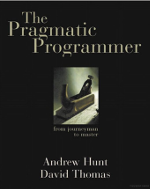
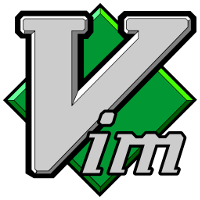

title: Taller de editores de texto
author:
  name: Las Palmas DevOps
  url: https://github.com/LasPalmasDevOps
output: presentacion.html
theme: sudodoki/reveal-cleaver-theme
controls: true

--

# Editores de texto
## Taller de introducción

--

### ¿Por qué es tan importante un editor de texto?
> Tip 22
>
> Use a Single Editor Well
>
> -- The Pragmatic Programmer
#

--

### Características deseables de un editor
* Configurable
* Extensible
* Programable

--

### Características de programación
* Syntax highlighting
* Auto-completado
* Auto-indentación
* Código inicial (boiler plate)
* Ayuda en línea
* IDE (compilación, tests, etc)

--

### Editores
* Vim
* Emacs
* Sublime Text
* ~~Eclipse/IntelliJ~~

--

> Comparison of text editors
> ##
> -- Wikipedia

--

### Vim
* Licencia: Charityware
* Versión estable: 7.4
##
http://www.vim.org/

--

### Puntos fuertes de Vim
* Ubicuo (multiplataforma y similitudes vi)
* Ideal para línea de órdenes
* Afín a cultura DevOps
* Cumple las premisas de Power Editing (Pragmatic Programmer)

--

### Características especiales de Vim I
* Modes (normal, insert, visual, command, etc)
* Operator + Motion
* Regex engine (search and replace)
* Registers

--

### Características especiales de Vim II
* Macros
* Buffers
* Autocompletion
* Extensible (plugins, scripting)

--

### ¿Qué veremos de Vim en el taller?
* Introducción básica
* Trabajaremos con los distintos modos
* Aprenderemos operadores y movimientos
* Realizaremos búsquedas y substituciones
* Usaremos macros para recordar acciones
* Autocompletado, y no solo de código
* Instalaremos plugins (pathogen o vundle) y veremos como retocarlos

--

### Emacs

#### the extensible, customizable, self-documenting, real-time display editor

--

* *GNU* Emacs
* Licencia: GNU GPL v.3
* Versión estable: 24.4

--

### Puntos fuertes de Emacs

* Multiplataforma (Win, Mac, POSIX, emacs...)
* Herramienta todoterreno
  * Línea de órdenes, X local, tramp, ...
  * Usos distintos (leng. prog., edición textos, IRC, org., ...)
* Hiperextensible

--

### Puntos fuertes de Emacs

* extensible
  * leng. prog.

* personalizable
  * sistema de conf.
  * leng. prog.

* auto-documentado
  * sistema de ayuda general
  * manuales
  * leng. prog.

* visualizado en tiempo real

* editor

--

### Características especiales de Emacs

* modos mayores y menores

* funciones/comandos y teclas

* buffers y minibuffer (y modeline)

--

### Características especiales de Emacs II

* puede (y suele) copiar lo bueno :)

* términos (y opciones por defecto) anticuadas :(

* no hay privilegio para lib. básicas :)

--

### ¿Qué veremos de Emacs en el taller?

* Tutorial básico (movernos, cerrar, cambiar buffer...)
* Algo de nomenclatura
* Sistema de ayuda
* Sistema de paquetes
* Configuración básica y avanzada
* Macros
* ...

--

### Sublime Text

* Software privativo
* Versión estable: 2.0.2
* Versión Beta: Build 3065

http://www.sublimetext.com/
--

### Puntos fuertes de Sublime Text

* Simplicidad
* Multiplataforma (Linux, Windows, MacOSX)
* Extensible mediante plugins escritos en Python normalmente
* Potentísimo sistema de plantillas de código

--

### Características especiales de Sublime Text I

* Mapa del fichero
* Paleta de comandos
* Búsqueda global (Go to Anything)
* Búsqueda y reemplazo usando expresiones regulares

--

### Características especiales de Sublime Text II

* Selección múltiple de texto
* Múltiples cursores para edición en bloque
* Definición de múltiples ventanas de edición
* Modo "Sin distracciones"

--

### ¿Qué veremos de Sublime Text en el taller?

* Partes básicas de la interfaz
* La paleta de comandos
* Selecciones múltiples y en bloque
* Gestión de un proyecto
* Búsqueda global y con expresiones regulares
* Package manager y plugins
* Lo que dé tiempo a probar

--

### IntelliJ

--

## Puntos fuertes de IntelliJ
* [Edición community con todo lo necesario](https://www.jetbrains.com/idea/features/editions_comparison_matrix.html)
* Gran catálogo de plugins
* Apenas hace falta usar el ratón

--

# Características especiales de IntelliJ
* Aistencia de código y refactorización.
* Corrección de ortografía (Inglés)
* Configura lo que se ejecuta y lo que se despliega

--

## ¿Qué vamos a hacer en el taller de IntelliJ?
* Como se usa
* Como se configura
* Como aplicar a la versión Ultimate

--

### Colaboradores

* Carlos López (https://github.com/morrizon)
* Oliver Gutiérrez (https://github.com/R3v1L)
* Johan Sebastian Cortes (https://www.twitter.com/hinigul)
* Abby Henríquez (https://github.com/paradoja)
