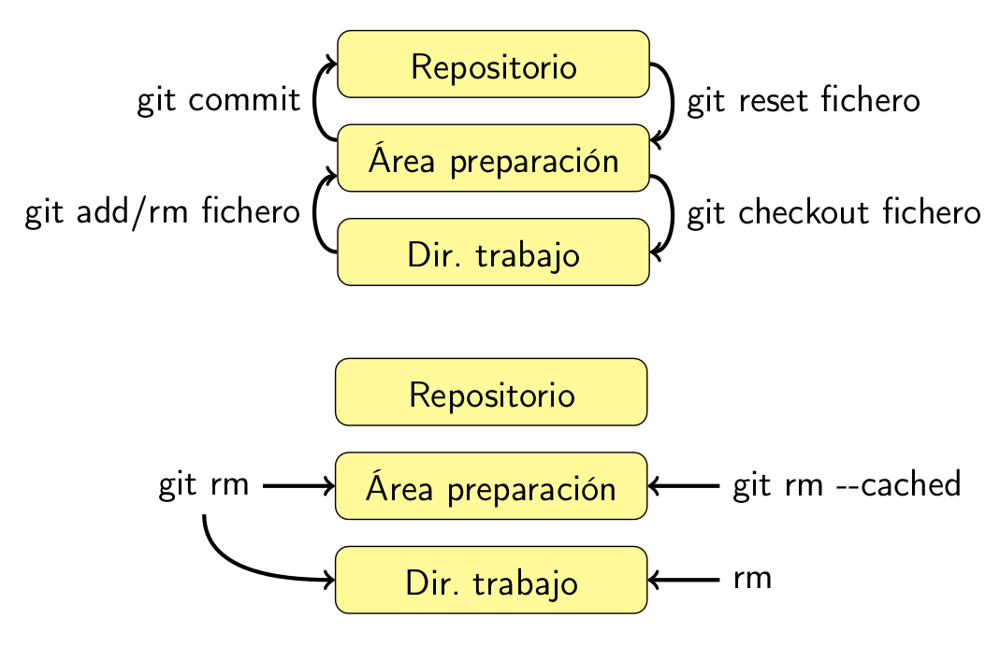
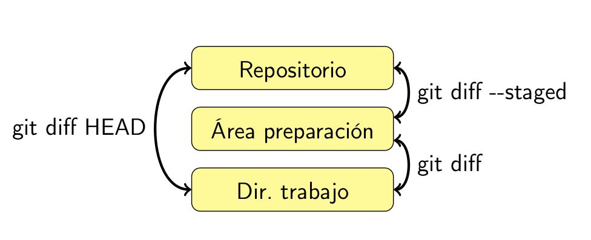
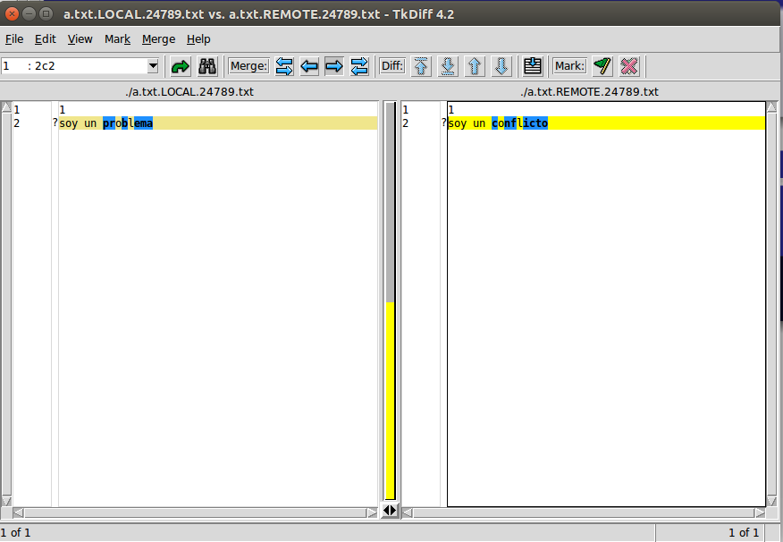

# Instalación

### Arch Linux

```
pacman -S git tkdiff lighttpd
```

### Debian y derivados

```
apt-get install git tkdiff lighttpd
```

### Gentoo

```
emerge --ask --verbose dev-vcs/git
emerge --ask --verbose dev-util/tkdiff
emerge --ask --verbose www-servers/ligthtpd
```

### RedHat, CentOS, fedora


```
yum install git tkdiff ligthttpd
```

### Suse

```
zypper install git tkdiff lighttpd
```

### MacOSX

.1 Forma gráfica
 
- [Git](https://code.google.com/p/git-osx-installer/)
- [Tkdiff](http://sourceforge.net/projects/tkdiff/files/tkdiff/4.2/)

.1 Usando homebrew

```
brew install git tkdiff lighttpd
```

### Windows (todavía lo usas :-( )

- [Git](http://git-scm.com/downloads)
- [Tkdiff](http://sourceforge.net/projects/tkdiff/files/tkdiff/4.2/)


# Parte local


### Estableciendo datos iniciales de git


```
git config --global user.name "Mi nombre"
git config --global user.email "minombre@midominio.com"
git config --global core.editor vim
git config --global color.ui true
```

### Establecer datos particulares dentro de un repo


Dentro de la carpeta del repo

```
git config --local user.name "Mi nombre"
git config --local user.email "minombre@otrodominio.com"
```


### Ver las opciones globales que tengo en mi máquina

``` 
git config --list
```

## Mi primer repo

### Crearlo localmente

```
$ git init mi_primer_repo
Initialized empty Git repository in /home/isra/LPDevOps/mi_primer_repo/.git/
..
$ ls -a mi_primer_repo
. .. .git
```


### Nuestro primer commit

```
$ echo "hola" > f.txt
$ git add f.txt
$ git commit -m "primer commit"
[master (root-commit) fae5ff8] primer commit
 1 file changed, 1 insertion(+)
 create mode 100644 f.txt
```

### Nuestro segundo commit

```
$ echo "adios" >> f.txt
$ git add f.txt
$ git commit -m "segundo commit"
[master d001cc9] segundo commit
 1 file changed, 1 insertion(+)
 ```

 * ¿ Qué significa root-commit ?
 * ¿ Por qué hacemos **git add** dos veces (lo veremos más adelante) ?

## Análisis de los 4 tipos de objetos de git

### Commits

```
$ git cat-file -p HEAD
tree 65de8c1fce51aedbc5b0c838d5d2be0883b3ab0e
parent fae5ff8d949952d9cfc049992bfda9bcffdaa391
author Israel Santana <isra@miscorreos.org> 1426282257 +0000
committer Israel Santana <isra@miscorreos.org> 1426282257 +0000

segundo commit
```

### Trees

* Lista de ficheros y trees
* Solo gestiona los bits de ejecución de ficheros
* No guarda directorios vacíos


```
$ git cat-file -p HEAD:
100644 blob 9114647dde3052c36811e94668f951f623d8005d  f.txt
```

### Blobs

* Son los ficheros que contiene nuestro repositorio

```
$ git cat-file -p HEAD:f.txt
hola
adios
```

### Tags

* Normalmente apuntan a commits
* Pueden firmarse mediate [GnuPG](https://www.gnupg.org/)

```
$ git tag -a v1.0 -m "version 1.0" HEAD
$ git cat-file -p v1.0
object d001cc9ddc2276f15f82f654db47320621d5e9d4
type commit
tag v1.0
tagger Israel Santana <isra@miscorreos.org> 1426284340 +0000

version 1.0
```

## Estructura física de un repositorio

Los repositorios normales tienen tres partes:

1. Directorio de trabajo
1. Grafo de objetos: .git
1. Área de preparación


### Algunos ficheros dentro de .git

```
 $ ls .git/
branches  COMMIT_EDITMSG  config  description  HEAD  hooks  
index  info  logs  objects  refs
```

#### Config

* Contiene la configuración local del repo

```
$ cat .git/config 
[core]
  repositoryformatversion = 0
  filemode = true
  bare = false
  logallrefupdates = true

```

#### description

* Descripción corta usada por gitweb

```
$ cat .git/description 
Unnamed repository; edit this file 'description' to name the repository.
```

#### HEAD

* Es una referencia simbólica a la revisión actual

```
$ cat .git/HEAD 
ref: refs/heads/master
```

#### hooks

* Se encargan de manejas los eventos

```
$ ls .git/hooks/
applypatch-msg.sample  pre-applypatch.sample      pre-push.sample
commit-msg.sample      pre-commit.sample          pre-rebase.sample
post-update.sample     prepare-commit-msg.sample  update.sample
```

#### index 

 * Contiene el área de preparación 

```
 $ git ls-files -s
100644 9114647dde3052c36811e94668f951f623d8005d 0 f.txt
```

#### info/exclude

* Patrones de los ficheros que git debe ignorar
* También podemos usar **.gitigone** 

```
$ cat .git/info/exclude 
# git ls-files --others --exclude-from=.git/info/exclude
# Lines that start with '#' are comments.
# For a project mostly in C, the following would be a good set of
# exclude patterns (uncomment them if you want to use them):
# *.[oa]
# *~
```

#### logs

* Contiene los logs

```
$ git reflog 
d001cc9 HEAD@{0}: commit: segundo commit
fae5ff8 HEAD@{1}: commit (initial): primer commit
```

### refs

* Contiene referencias simbólicas a las puntas de cada rama y etiquetas

```
$ ls -R .git/refs/
.git/refs/:
heads  tags

.git/refs/heads:
master

.git/refs/tags:
v1.0
```

### objects

* Objectos

```
$ ls .git/objects/
46  5c  65  91  9a  d0  fa  info  pack
```

* Se pueden empaquetar cuando tenemos muchos (este no es el caso :p)

```
$ git gc
Counting objects: 7, done.
Delta compression using up to 4 threads.
Compressing objects: 100% (3/3), done.
Writing objects: 100% (7/7), done.
Total 7 (delta 0), reused 0 (delta 0)
$ ls .git/objects/pack/
pack-6ca1c4f22503f0a4ce672fcdea373d4ee1e09aaa.idx  
pack-6ca1c4f22503f0a4ce672fcdea373d4ee1e09aaa.pack
```

## Área de preparación, caché o índice

* Es una nueva instántanea que vamos construyendo para la próxima revisión.

* Si vienes de svn piensa que **svn add** añade un fichero a un control de versiones y **git add** añade contenido al área de preparación.

* Gracias a esto podemos controlar exactamente que ponemos en cada revisión. Al principio cuesta un poco pero es bastante potente.

* No confundir lo que hace clientes como [TortoiseSVN](http://tortoisesvn.net)

### Preparando una nueva revisión

* Sigamos con nuestro ejemplo

```
$ echo "bueno" >> f.txt
$ git add f.txt
$ echo "malo" >> f.txt
$ echo "nuevo" > g.txt
```

* Comprobamos el estado de nuestro repo

```
$ git status
En la rama master
Cambios para hacer commit:
  (use «git reset HEAD <archivo>...«para eliminar stage)

  modificado: f.txt

Cambios no preparados para el commit:
  (use «git add <archivo>...» para actualizar lo que se ejecutará)
  (use «git checkout -- <archivo>...« para descartar cambios en le directorio de trabajo)

  modificado: f.txt

Archivos sin seguimiento:
  (use «git add <archivo>...» para incluir lo que se ha de ejecutar)

  g.txt

```

* Diferencias entre el repositorio y nuestra área de preparación

```
$ git diff --staged
diff --git a/f.txt b/f.txt
index 9114647..3d0a14e 100644
--- a/f.txt
+++ b/f.txt
@@ -1,2 +1,3 @@
 hola
 adios
+bueno

```

* Diferencias entre nuestro la zona de preparación y direcotorio de trabajo 

```
$ git diff
diff --git a/f.txt b/f.txt
index 3d0a14e..ad3ec81 100644
--- a/f.txt
+++ b/f.txt
@@ -1,3 +1,4 @@
 hola
 adios
 bueno
+malo

``` 

* Diferencias entre el repositorio y nuestro directorio de trabajo

```
$ git diff HEAD
diff --git a/f.txt b/f.txt
index 3d0a14e..ad3ec81 100644
--- a/f.txt
+++ b/f.txt
@@ -1,2 +1,4 @@
 hola
 adios
+bueno
+malo
diff --git a/g.txt b/g.txt
new file mode 100644
index 0000000..36080d9
--- /dev/null
+++ b/g.txt
@@ -0,0 +1 @@
+nuevo


```
* Hagamos nuestro tercer commit 

```
$ git commit -m "tercer commit"
[master 13602d8] tercer commit
 1 file changed, 1 insertion(+)
```

```
$ git status 
En la rama master
Cambios no preparados para el commit:
  (use «git add <archivo>...» para actualizar lo que se ejecutará)
  (use «git checkout -- <archivo>...« para descartar cambios en le directorio de trabajo)

  modificado: f.txt

Archivos sin seguimiento:
  (use «git add <archivo>...» para incluir lo que se ha de ejecutar)

  g.txt

no hay cambios agregados al commit (use «git add» o «git commit -a»)
```

### Esquema para añadir y quitar




### Esquema para comparar



### Modificar nuestro commit

* Veamos el estado de nuestro repo

```
$ git log --pretty=oneline
75990e36004ed3089da2ab0232944e93144a9b8d tercer commit
d001cc9ddc2276f15f82f654db47320621d5e9d4 segundo commit
fae5ff8d949952d9cfc049992bfda9bcffdaa391 primer commit
```

```
$ git status 
En la rama master
Archivos sin seguimiento:
  (use «git add <archivo>...» para incluir lo que se ha de ejecutar)

  g.txt

no se ha agregado nada al commit pero existen archivos sin seguimiento (use «git add» para darle seguimiento)
```

* Nos hemos dado cuenta que nos faltó añadir nuestro archivo g.txt y lo queremos en ese commit


```
$ git add g.txt 
$ git commit --amend -m "tercer commit"
[master 6d088e0] tercer commit
 2 files changed, 3 insertions(+)
 create mode 100644 g.txt
```

```
$ git log --pretty=oneline
6d088e0572b73a2493c84b9907cc8e26b7e22029 tercer commit
d001cc9ddc2276f15f82f654db47320621d5e9d4 segundo commit
fae5ff8d949952d9cfc049992bfda9bcffdaa391 primer commit
```

```
$ git status 
En la rama master
nothing to commit, working directory clean
```

### Moviendo ficheros en git

* Lo hacemos con la opción mv

```
$ git mv g.txt h.txt
$ git status
En la rama master
Cambios para hacer commit:
  (use «git reset HEAD <archivo>...«para eliminar stage)

  renombrado: g.txt -> h.txt
```

### Borrando commit

* Borrado los dos últimos commit y dejando todo antes de hacer el commit

```
$ git reset HEAD~2
$ git log --pretty=oneline
fae5ff8d949952d9cfc049992bfda9bcffdaa391 primer commit
$ git status
En la rama master
Cambios no preparados para el commit:
  (use «git add <archivo>...» para actualizar lo que se ejecutará)
  (use «git checkout -- <archivo>...« para descartar cambios en le directorio de trabajo)

  modificado: f.txt

Archivos sin seguimiento:
  (use «git add <archivo>...» para incluir lo que se ha de ejecutar)

  g.txt

no hay cambios agregados al commit (use «git add» o «git commit -a»)
```

* Ahora hacemos el segundo commit

```
$ git add .
$ git commit -m "segundo commit"
[master 7b63fcb] segundo commit
 2 files changed, 4 insertions(+)
 create mode 100644 g.txt
$ git log --pretty=oneline
7b63fcbd434de60b237a64108bee328caa699660 segundo commit
fae5ff8d949952d9cfc049992bfda9bcffdaa391 primer commit
```

* Borrado de verdad (no hay marcha atrás !!!!!!!), borraremos todo desde nuestro primer commit

```
$ git reset --hard fae5ff8
HEAD is now at fae5ff8 primer commit
$ git log --pretty=oneline
fae5ff8d949952d9cfc049992bfda9bcffdaa391 primer 
$ git status 
En la rama master
nothing to commit, working directory clean
$ ls
f.txt
```

## Operaciones comunes

* **git grep**: como grep -R, pero sólo busca ficheros versionados

```
$ git grep hola
f.txt:hola
```

* **git log**: un histórico

```
$ git log
commit fae5ff8d949952d9cfc049992bfda9bcffdaa391
Author: Israel Santana <isra@miscorreos.org>
Date:   Fri Mar 13 21:28:41 2015 +0000

    primer commit
```

```
$ git log --pretty=oneline
fae5ff8d949952d9cfc049992bfda9bcffdaa391 primer commit
```

```
$ git log  --graph --pretty=oneline --decorate=short --abbrev-commit
* 9247034 (HEAD, feature-x) sexto commit
* 64672ec quinto commit
* 2ab764b cuarto commit
* 41871b0 tercer commit
* c99b9d6 segundo commit
* fae5ff8 primer commit
```

* Por autor: --author, --committer
* Por fecha: --since, --until
* Por mensaje: --grep

* **git show revision**, muestra la revision
* **git instaweb**, nos muestra el repo vía web

## Ayuda

### Genérica

* **git help** listado breve (porcelana)
* **git help --all** listado completo (fontanería)

### Concreta

* **man git-orden**
* **git help orden**
* **git help -w orden**
* **git orden -h**


## Ejercicios primera parte

* [Aquí los tienes](ejercicios/ejercicios_locales.md)

# Parte remota

## Métodos de acceso

* git
* ssh
* http
* http
* rysnc

## Clonar un repositorio remoto con una nuestro

* Es muy fácil *git clone repositorio_repoto* :-P

```
$ git clone https://github.com/LasPalmasDevOps/Talleres.git
Clonar en «Talleres»...
remote: Counting objects: 468, done.
remote: Compressing objects: 100% (28/28), done.
remote: Total 468 (delta 16), reused 0 (delta 0), pack-reused 434
Receiving objects: 100% (468/468), 729.52 KiB | 680.00 KiB/s, done.
Resolving deltas: 100% (190/190), done.
Checking connectivity... hecho.
```

## Gestionado de repositorios remotos con nuestro repositorio local


### Listar

* Un repositorio local puede tener uno o varios repositorio remotos, para ver cuales tener configurados.

```
$ git remote
origin
```

* *origin* se define como repositorio original cuando clonamos un repositorio.

* Si quieres tener la información de cual es nuestro repositorio remoto y el protocolo de comunicación.

```
$ git remote -v
origin  https://github.com/LasPalmasDevOps/Talleres.git (fetch)
origin  https://github.com/LasPalmasDevOps/Talleres.git (push)
```

### Añadir

* Para añadir un repositorio remoto al nuestro *git remote add ALIAS REPOSITORIO*


```
$ git remote add otro_origen https://mi_segundo_repo/repo.git
$git remote -v
origin  https://github.com/LasPalmasDevOps/Talleres.git (fetch)
origin  https://github.com/LasPalmasDevOps/Talleres.git (push)
otro_origen https://mi_segundo_repo/repo.git (fetch)
otro_origen https://mi_segundo_repo/repo.git (push)
```

### Cambiar alias

* Para cambiar el alias *git remote rename alias nuevo_alias*

```
$ git remote rename otro_origen segundo_origen
$ git remote -v
origin  https://github.com/LasPalmasDevOps/Talleres.git (fetch)
origin  https://github.com/LasPalmasDevOps/Talleres.git (push)
segundo_origen  https://mi_segundo_repo/repo.git (fetch)
segundo_origen  https://mi_segundo_repo/repo.git (push)
```

### Cambiar url de un repositorio remoto

* Para cambiar se hace con *git remote set-url alias nueva_url*

```
$ git remote set-url  segundo_origen https://otra_url/repo.git
$ git remote -v
origin  https://github.com/LasPalmasDevOps/Talleres.git (fetch)
origin  https://github.com/LasPalmasDevOps/Talleres.git (push)
segundo_origen  https://otra_url/repo.git (fetch)
segundo_origen  https://otra_url/repo.git (push)


```
### Borrado

Para borrar repositorio remoto al nuestro *git remote del alias*

```
$ git remote remove segundo_origen
$ git remote -v
origin  https://github.com/LasPalmasDevOps/Talleres.git (fetch)
origin  https://github.com/LasPalmasDevOps/Talleres.git (push)
```

## Sincronización de repositorio

* Para traernos los cambios del repositorio remoto debemos hacer *git pull repositorio rama*, por defecto si ejecutamos *git pull* estaremos haciendo *git pull origin master*

* Para subir los cambios lo debemos hacer con *git push repositorio rama*, lo habitual es *git push origin master*

### Cambio de comportamiento de *git push*

Las versiones anteriores de git tenían un comportamiento por defecto a la hora de hacer push llamado ‘matching’.

Este consiste en que, al hacer push, se sincronizan todas las ramas del proyecto con sendas ramas en el servidor con el mismo nombre (ya hablaremos en detalle de las ramas más adelante). Si en el servidor no existe una rama con el nombre de alguna local, se crea automáticamente.

La versión 2 de git cambiará ese comportamiento, que pasará a ser simple, lo que significa que se sube sólo la rama que tienes activa en este momento a la rama de la que has hecho el pull, pero te dará un error si el nombre de esa rama es distinto.

Mientras tanto, actualmente, git te avisa (a cada push) de que se va a hacer este cambio y te avisa de que puedes configurar este comportamiento por defecto con un mensaje como este:

```
warning: push.default is unset; its implicit value is changing in
Git 2.0 from 'matching' to 'simple'. To squelch this message
and maintain the current behavior after the default changes, use:

git config --global push.default matching

To squelch this message and adopt the new behavior now, use:

git config --global push.default simple

When push.default is set to 'matching', git will push local branches
to the remote branches that already exist with the same name.

In Git 2.0, Git will default to the more conservative 'simple'
behavior, which only pushes the current branch to the corresponding
remote branch that 'git pull' uses to update the current branch.

See 'git help config' and search for 'push.default' for further information.
(the 'simple' mode was introduced in Git 1.7.11. Use the similar mode
'current' instead of 'simple' if you sometimes use older versions of Git)
``` 

Para elegir el comportamiento que prefieres sólo tienes que usar, como ya hemos visto para otras configuraciones, el comando git config de este modo:

*git config --global push.default OPCION*

Por ejemplo:

*git config --global push.default matching*

Usaría la opción matching en todos tus repositorios, pero:

*git config --local push.default simple*

Usaría la opción simple sólo en el repositorio en el que te encuentras.

Otras opciones posibles son:

* current: Sube los cambios de la rama activa a una rama remota del mismo nombre. Si no existe esa rama remota, se crea.
* nothing: Esta opción sólo tiene sentido para test, debugs y esas cosas. Al hacer push no se subirá nada a repositorio remoto.
* upstream: Al igual que simple, sube la rama que tienes activa a la rama de la que has hecho el pull pero, en este caso, no te dará error si el nombre de esa rama es distinto.


## Ramas

### Ver ramas
* *git branch*

```
$ git branch
* master
```

### Creación de rama

* *git branch nueva-rama*

```
$ git branch nueva-rama
$ git branch
* master
  nueva-rama
```

* El asterisco marca la rama activa

### Cambiar de rama

* *git checkcout nueva-rama*

```
$ git checkout nueva-rama
Switched to branch 'nueva-rama'
```

> *TIP*: Para hacer las dos cosas a la vez *git checkout -b nueva-rama*

### Fusionar ramas

* Se realiza con *git merge*
* Supongamos que hemos realizado cambios en rama *nueva-rama* y queremos fusionarlo en nuestra rama master.

#### Si no hay conflictos

```
(nueva-rama)$ git checkout master
Switched to branch 'master'
(master)$ git merge nueva-rama
Updating d27e49f..0654c1b
Fast-forward
 a.txt | 1 +
 1 file changed, 1 insertion(+)
```


#### Si hay conflictos
```
(master)$ git merge nueva-rama
Automezclado a.txt
CONFLICTO(contenido): conflicto de fusión en a.txt
Automatic merge failed; fix conflicts and then commit the result.
(master|MERGING)$ git mergetool 
Merging:
a.txt

Normal merge conflict for 'a.txt':
  {local}: modified file
  {remote}: modified file
Hit return to start merge resolution tool (tkdiff):
(master|MERGING)$ git add a.txt
(master|MERGING)$ git commit -m "conflicto resuelto"
[master 7d292a0] conflicto resuelto
isra@xps:~/tmp/3/ramas (master)$ 
```

* Pantallazo tkdiff



### Ramas remotas

#### Creación de rama desde local

* *git push --set-upstream origin nueva-rama*

#### Creación desde rama remota a rama local

* *git checkout -b nueva-rama origin/nueva-rama*


## Ejercicios segunda parte

* [Aquí los tienes](ejercicios/ejercicios_remotos.md)